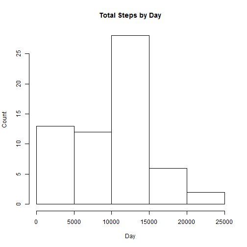
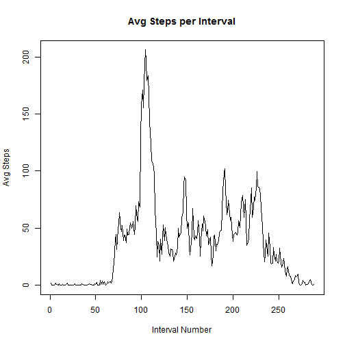
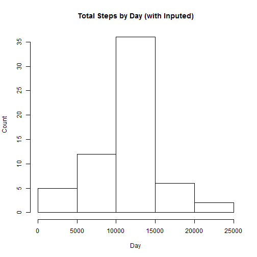
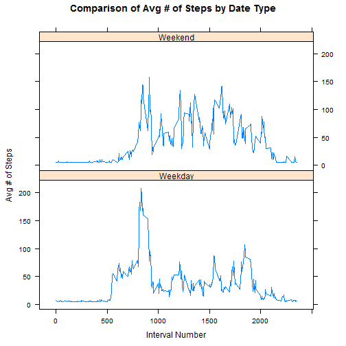

## Loading and preprocessing the data


```r
str(activity <- read.csv("activity.csv"))
```

```
## 'data.frame':	17568 obs. of  3 variables:
##  $ steps   : int  NA NA NA NA NA NA NA NA NA NA ...
##  $ date    : Factor w/ 61 levels "2012-10-01","2012-10-02",..: 1 1 1 1 1 1 1 1 1 1 ...
##  $ interval: int  0 5 10 15 20 25 30 35 40 45 ...
```

### Convert to an R date field


```r
activity$r.date <- as.Date(activity$date, "%Y-%m-%d")
```

## What is mean total number of steps taken per day?

### Make a histogram of the total number of steps taken each day

```r
total.daily.steps <- tapply(activity$steps, activity$r.date, sum, na.rm = TRUE)

hist(total.daily.steps, xlab = "Day", ylab = "Count", main = "Total Steps by Day")
```

 

### Calculate and report the mean and median total number of steps taken per day

```r
mean.steps <- mean(total.daily.steps)
median.steps <- median(total.daily.steps)
```

The mean steps per day is 9354.2295.
The median steps per day is 10395.

## What is the average daily activity pattern?

### Make a time series plot (i.e. type = "l") of the 5-minute interval (x-axis) and the average number of steps taken, averaged across all days (y-axis)

```r
interval.steps.mean <- tapply(activity$steps, activity$interval, mean, na.rm = TRUE)

plot(interval.steps.mean, type = "l", main = "Avg Steps per Interval", xlab = "Interval Number", ylab = "Avg Steps")
```

 

### Which 5-minute interval, on average across all the days in the dataset, contains the maximum number of steps?

```r
max.avg.steps <- names(which.max(interval.steps.mean))
```

The interval with the highest average number of steps is 835.

## Imputing missing values

### Calculate and report the total number of missing values in the dataset (i.e. the total number of rows with NAs)

```r
activity.na <- sum(is.na(activity))
```

The total number of rows with NA values is 2304.

### Impute NA values using the global mean number of steps

```r
activity.impute <- activity
require(Hmisc)
```

```
## Loading required package: Hmisc
## Loading required package: grid
## Loading required package: lattice
## Loading required package: survival
## Loading required package: splines
## Loading required package: Formula
## 
## Attaching package: 'Hmisc'
## 
## The following objects are masked from 'package:base':
## 
##     format.pval, round.POSIXt, trunc.POSIXt, units
```

```r
activity.impute$steps <- impute(activity.impute$steps, mean)
```

### Repeat earlier analysis using imputed values

```r
total.daily.steps.impute <- tapply(activity.impute$steps, activity.impute$date, sum)

hist(total.daily.steps.impute, xlab = "Day", ylab = "Count", main = "Total Steps by Day (with Inputed)")
```

 

```r
mean.steps.impute <- mean(total.daily.steps.impute)
median.steps.impute <- median(total.daily.steps.impute)
```

The mean steps per day after imputation is 1.0766 &times; 10<sup>4</sup>.
The median steps per day after imputation is 1.0766 &times; 10<sup>4</sup>.

The imputation appears to have caused summary statistics to be higher.

## Are there differences in activity patterns between weekdays and weekends?

### Create a new factor variable in the dataset with two levels - "weekday" and "weekend" indicating whether a given date is a weekday or weekend day.

```r
activity.impute$date.type <- as.factor(ifelse(weekdays(activity.impute$r.date) %in% c("Saturday", "Sunday"), "Weekend", "Weekday"))
str(activity.impute)
```

```
## 'data.frame':	17568 obs. of  5 variables:
##  $ steps    :Class 'impute'  atomic [1:17568] 37.4 37.4 37.4 37.4 37.4 ...
##   .. ..- attr(*, "imputed")= int [1:2304] 1 2 3 4 5 6 7 8 9 10 ...
##  $ date     : Factor w/ 61 levels "2012-10-01","2012-10-02",..: 1 1 1 1 1 1 1 1 1 1 ...
##  $ interval : int  0 5 10 15 20 25 30 35 40 45 ...
##  $ r.date   : Date, format: "2012-10-01" "2012-10-01" ...
##  $ date.type: Factor w/ 2 levels "Weekday","Weekend": 1 1 1 1 1 1 1 1 1 1 ...
```

```r
is.factor(activity.impute$date.type)
```

```
## [1] TRUE
```

### Make a panel plot containing a time series plot (i.e. type = "l") of the 5-minute interval (x-axis) and the average number of steps taken, averaged across all weekday days or weekend days (y-axis).

```r
date.type.means <- aggregate(steps ~ date.type + interval, data = activity.impute, mean)

require(lattice)
xyplot(steps ~ interval | date.type, data = date.type.means, layout = c(1,2), type = "l", main = "Comparison of Avg # of Steps by Date Type", xlab = "Interval Number", ylab = "Avg # of Steps")
```

 
